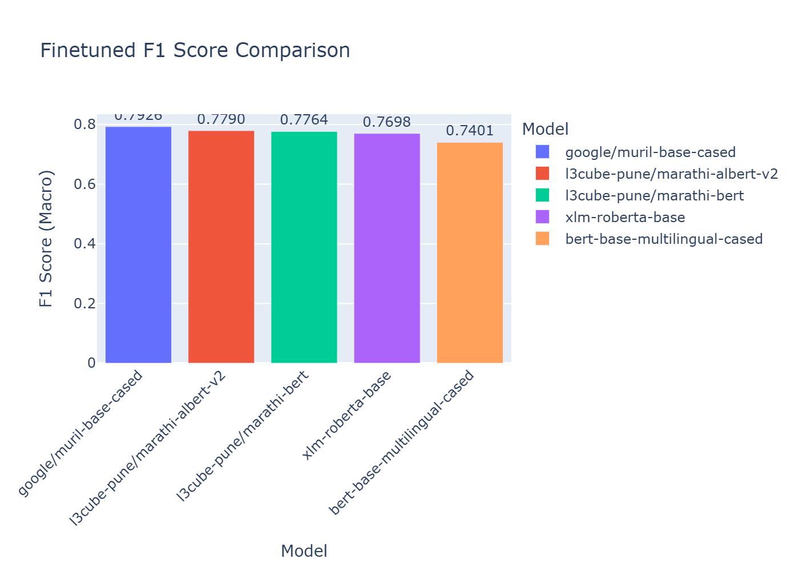
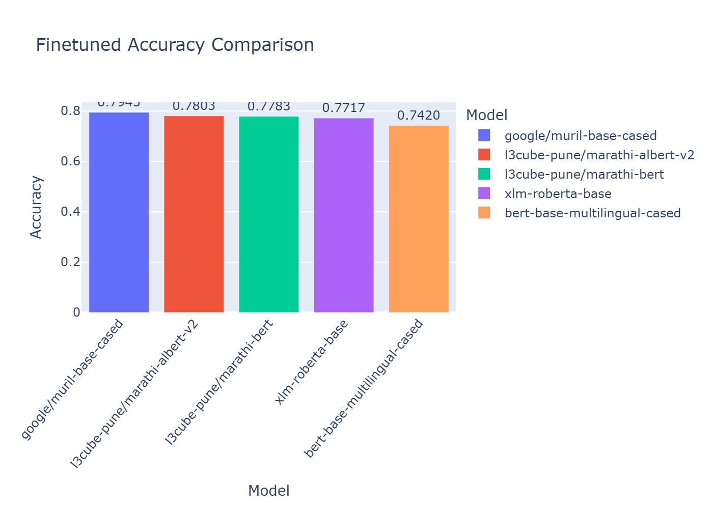
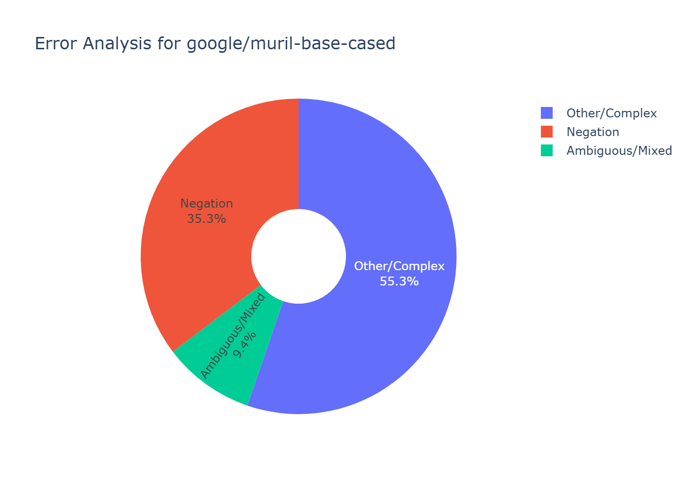

# Fine-Tuning Transformer Models for Marathi Sentiment Analysis

**Author**: Ashish Parmar
**Date**: September 18, 2025
**Version**: 1.1.0

---

### **Abstract**

This paper presents an empirical study on fine-tuning various transformer-based language models for sentiment analysis on a Marathi-language dataset. We evaluate and compare the performance of several multilingual and Marathi-specific models, including `xlm-roberta-base`, `bert-base-multilingual-cased`, `google/muril-base-cased`, and variants from the L3Cube-MahaNLP suite. The objective is to identify the most effective model architecture for this task and to conduct a thorough qualitative error analysis to understand its limitations in handling complex linguistic nuances such as negation, sarcasm, and code-mixing. Our results indicate that **google/muril-base-cased** achieves the highest performance, with a macro F1-score of **0.7926** and an accuracy of **0.7943**. This study provides valuable insights and a reproducible benchmark for practitioners working on sentiment analysis for low-resource Indic languages.

---

## 1. Introduction

Sentiment analysis is a critical task in Natural Language Processing (NLP) with wide-ranging applications, from social media monitoring to customer feedback analysis. While significant progress has been made for high-resource languages like English, low-resource languages such as Marathi present unique challenges due to the scarcity of labeled data and monolingual pretrained models. This project aims to address this gap by systematically fine-tuning and evaluating a suite of transformer models on a custom Marathi sentiment dataset, thereby creating a robust baseline for future research.

The primary contributions of this work are:
- A standardized, end-to-end pipeline for fine-tuning and evaluating sentiment analysis models in Marathi, suitable for GPUs with moderate memory (e.g., NVIDIA RTX 4050).
- A comparative analysis of several state-of-the-art multilingual and Marathi-specific models to determine their relative effectiveness.
- A detailed qualitative error analysis of the best-performing model to identify common failure modes and suggest concrete directions for future research and model improvement.

## 2. Project Structure

The repository is organized to ensure reproducibility and a clear separation of concerns between training, analysis, and results.

```
. (c:/LLM's_for_SA/)
├── LLMs_testing/
│   ├── analysis.ipynb               # Notebook to analyze results and generate this README
│   ├── marathi_finetune_and_eval.ipynb          (for xlm-roberta-base)
│   ├── marathi_finetune_and_eval_mbert.ipynb    (for bert-base-multilingual-cased)
│   ├── marathi_finetune_and_eval_muril.ipynb    (for google/muril-base-cased)
│   ├── marathi_finetune_and_eval_l3cube.ipynb   (for l3cube-pune/marathi-bert)
│   ├── marathi_finetune_and_eval_mahaalbert_v1.ipynb (for l3cube-pune/mahaalbert)
│   ├── README.md                    # This documentation file
│   ├── requirements.txt             # Python dependencies for the analysis
│   └── images/                      # Directory for storing plots and visualizations
│       ├── f1_comparison.png
│       ├── accuracy_comparison.png
│       └── error_analysis.png
│
├── output/
│   └── balanced_mode_strict_domain.csv # The dataset used for training and evaluation
│
└── results/
    └── notebook_run/                  # Directory containing outputs from all training runs
        └── <timestamp>_<model_name>/  # Each run has its own folder with checkpoints, logs, and metrics
```

## 3. Methodology

### 3.1. Dataset

The experiments were conducted on a custom dataset of Marathi text, `balanced_mode_strict_domain.csv`, labeled with three sentiment classes: `positive`, `neutral`, and `negative`. The dataset was preprocessed and split into training (80%), validation (10%), and testing (10%) sets using stratified sampling to maintain the label distribution across all splits.

### 3.2. Models Evaluated

The following pretrained transformer models were selected for this study, representing a mix of general multilingual models and models specifically trained on Marathi or other Indic languages:

| Model                         |
|:------------------------------|
| google/muril-base-cased       |
| l3cube-pune/marathi-albert-v2 |
| l3cube-pune/marathi-bert      |
| xlm-roberta-base              |
| bert-base-multilingual-cased  |

### 3.3. Experimental Setup

All models were fine-tuned using the Hugging Face `transformers` and `accelerate` libraries on a system equipped with an NVIDIA RTX 4050 GPU. The training was configured with the following key hyperparameters:
- **Optimizer**: AdamW
- **Learning Rate**: 2e-5
- **Batch Size**: 16 (with gradient accumulation where necessary)
- **Epochs**: 2
- **Maximum Sequence Length**: 192 tokens
- **Evaluation Strategy**: Metrics were computed at the end of each epoch, and the model checkpoint with the best macro F1-score on the validation set was saved for the final evaluation.

## 4. Results and Discussion

### 4.1. Quantitative Analysis

The performance of each fine-tuned model was evaluated on the held-out test set. The table below summarizes the key metrics, comparing the baseline (pre-fine-tuning) performance with the final fine-tuned results. Models are sorted by macro F1-score.

| Model                         |   Baseline Accuracy |   Baseline F1 |   Finetuned Accuracy |   Finetuned F1 |   Run Directory | Model Link |
|:------------------------------|--------------------:|--------------:|---------------------:|---------------:|----------------:|:-----------|
| Ensemble (Muril+Albert+MBERT) |                   — |             — |             0.908000 |       0.907620 |        Ensemble | [Ensemble Note](ENSEMBLE.md) |
| google/muril-base-cased       |            0.333333 |      0.166667 |             0.794333 |       0.79255  | 20250917_142448 | [google/muril-base-cased](https://huggingface.co/AshParmar/XMR-Muril) |
| l3cube-pune/marathi-albert-v2 |            0.333333 |      0.166667 |             0.780333 |       0.779034 | 20250917_180532 | [l3cube-pune/marathi-albert-v2](https://huggingface.co/AshParmar/XMR-Albert) |
| l3cube-pune/marathi-bert      |            0.331    |      0.168996 |             0.778333 |       0.776411 | 20250917_173302 | [l3cube-pune/marathi-bert](https://huggingface.co/AshParmar/XMR-MBERT) |
| xlm-roberta-base              |            0.333333 |      0.166667 |             0.771667 |       0.769817 | 20250917_203037 | [xlm-roberta-base](https://huggingface.co/AshParmar/XMR-xlm-ROBERTA) |
| bert-base-multilingual-cased  |            0.344333 |      0.256454 |             0.742    |       0.740075 | 20250917_162312 | [bert-base-multilingual-cased](https://huggingface.co/AshParmar/XMR-MultiBERT) |




As evidenced by the results, **google/muril-base-cased** significantly outperforms the other models, achieving an F1-score of **0.7926**. This suggests that models specifically pretrained on or for Indic languages, which often include transliterated and mixed-language data, hold a considerable advantage over general multilingual models for this task.

### 4.1.1. Ensemble Inference (Soft Voting)

To squeeze out a bit more performance, you can ensemble multiple uploaded models from Hugging Face via weighted soft-voting. A helper script `ensemble_inference.py` is provided to load 2–3 models, run batched inference on the test split, and compute metrics.

Defaults (from the top-3 models above):
- Models: `AshParmar/XMR-Muril`, `AshParmar/XMR-Albert`, `AshParmar/XMR-MBERT`
- Weights: derived from the models' macro F1 (normalized internally)

Try it (Windows PowerShell):

```powershell
# From the LLMs_testing folder
python .\ensemble_inference.py --test-csv ..\output\combined_dataset\test_strict.csv --label-col label

# Customize models or weights (example)
python .\ensemble_inference.py --models AshParmar/XMR-Muril AshParmar/XMR-Albert --weights 0.8 0.2 --test-csv ..\output\combined_dataset\test_strict.csv
```

Outputs:
- `../output/ensemble_results.json` — accuracy, macro F1, classification report, confusion matrix
- `../output/ensemble_predictions.csv` — test rows with predicted labels appended

For a deeper dive (method, equations, limitations), see `ENSEMBLE.md`.

### 4.2. Qualitative Error Analysis

To understand the qualitative behavior of the best model, **google/muril-base-cased**, we conducted a detailed analysis of its misclassifications on the test set.



The errors were programmatically categorized based on linguistic phenomena to identify systemic weaknesses:
| Error Category    |   count |
|:------------------|--------:|
| Neutral Ambiguity |      21 |
| Negation          |       7 |
| Idiom/Complex     |       2 |

The following table provides concrete examples of these errors and their likely causes:

| Text                                                                                                          | True Label   | Predicted Label   | Error Category    | Potential Reason for Error                                                                                                            |
|:--------------------------------------------------------------------------------------------------------------|:-------------|:------------------|:------------------|:--------------------------------------------------------------------------------------------------------------------------------------|
| त्यांच्या दडपलेल्या भावना केवळ त्या पृष्ठभागावर येतात जेव्हा गोष्टी नियोजित प्रमाणे जात नाहीत                                                   | neutral      | negative          | Negation          | The model failed to correctly process a negative word like 'नाही' (not), leading to a misclassification of the sentiment.               |
| मला असे वाटले की आपण असे कोणीतरी आहात ज्याला मी शेवटी उघडू शकलो.                                                                | neutral      | negative          | Neutral Ambiguity | The sentence is fact-based or lacks strong sentiment, but the model forced a positive or negative classification.                     |
| मी गंभीर आहे.                                                                                                     | neutral      | negative          | Neutral Ambiguity | The sentence is fact-based or lacks strong sentiment, but the model forced a positive or negative classification.                     |
| अरे आता तुला पॅड पाहिजे.                                                                                              | negative     | neutral           | Neutral Ambiguity | The sentence has subtle sentiment (positive or negative) that the model missed, causing it to default to a 'safe' neutral prediction. |
| कारण यामध्ये रोमॅंटिक काय आहे आणि कॉमेडी काय आहे हे शेवटपर्यंत कळत नाही                                                             | neutral      | negative          | Negation          | The model failed to correctly process a negative word like 'नाही' (not), leading to a misclassification of the sentiment.               |
| खोलीभोवती त्याचा पाठलाग.                                                                                               | neutral      | negative          | Neutral Ambiguity | The sentence is fact-based or lacks strong sentiment, but the model forced a positive or negative classification.                     |
| या संकल्पनेसाठी समीर आणि त्याच्या टीमला हॅटस ऑफ                                                                              | positive     | neutral           | Neutral Ambiguity | The sentence has subtle sentiment (positive or negative) that the model missed, causing it to default to a 'safe' neutral prediction. |
| घटस्फोटाची काळजी घेणार्‍या पिलो-टॉप राणीसाठी $499?                                                                               | negative     | neutral           | Neutral Ambiguity | The sentence has subtle sentiment (positive or negative) that the model missed, causing it to default to a 'safe' neutral prediction. |
| जाण्यासाठी मार्ग!                                                                                                    | positive     | neutral           | Neutral Ambiguity | The sentence has subtle sentiment (positive or negative) that the model missed, causing it to default to a 'safe' neutral prediction. |
| दशावतार कलेबद्दल ती साकारणाऱ्यांबद्दल काहीही माहिती नसलेल्यांना सिनेमातून नवं असं काही मिळत नाही                                                | negative     | neutral           | Negation          | The model failed to correctly process a negative word like 'नाही' (not), leading to a misclassification of the sentiment.               |
| या चित्रपटाच्या निमित्ताने रणवीर खऱ्या अर्थाने एका रॅपरचं आयुष्य जगला आहे                                                             | positive     | neutral           | Neutral Ambiguity | The sentence has subtle sentiment (positive or negative) that the model missed, causing it to default to a 'safe' neutral prediction. |
| केवळ एका व्यावसायिक सिनेमाचं कथानक म्हणूनच त्याच्याकडे पाहायला हवं                                                                  | negative     | neutral           | Neutral Ambiguity | The sentence has subtle sentiment (positive or negative) that the model missed, causing it to default to a 'safe' neutral prediction. |
| दिपीका-रणवीरच्या लग्नानंतर रणवीरचा हा पहिलाच सिनेमा आहे                                                                         | positive     | neutral           | Neutral Ambiguity | The sentence has subtle sentiment (positive or negative) that the model missed, causing it to default to a 'safe' neutral prediction. |
| बाँड असे आहे की आपण ज्या यश आणि अपयशांमध्ये पूर्णपणे गुंतवणूक केली नाही तोपर्यंत ते आपल्या अंतःकरणाकडे लक्ष देईल                                | positive     | neutral           | Negation          | The model failed to correctly process a negative word like 'नाही' (not), leading to a misclassification of the sentiment.               |
| ही मालतीची गोष्ट नक्कीच बघण्यासारखी आहे                                                                                    | neutral      | positive          | Neutral Ambiguity | The sentence is fact-based or lacks strong sentiment, but the model forced a positive or negative classification.                     |
| दोन, जॉयसोबतच्या माझ्या मैत्रीची मला किती काळजी आहे हे सिद्ध होते.                                                                   | neutral      | negative          | Neutral Ambiguity | The sentence is fact-based or lacks strong sentiment, but the model forced a positive or negative classification.                     |
| हे निळ्याच्या मध्यभागी स्मॅक-डॅब आहे!                                                                                      | negative     | neutral           | Neutral Ambiguity | The sentence has subtle sentiment (positive or negative) that the model missed, causing it to default to a 'safe' neutral prediction. |
| पण याच वळणावर विराज अप्पांकडे पेइंग गेस्ट म्हणून राहायला येतो आणि नंदिनीचं विस्कटायच्या मार्गावर असलेलं तिचं एकटीचं आयुष्यच नाही तर तिची तुटायला आलेली नातीही सांधतो | positive     | neutral           | Negation          | The model failed to correctly process a negative word like 'नाही' (not), leading to a misclassification of the sentiment.               |
| हा सिनेमा पाहिल्यावर नक्कीच प्रत्येकाच्या डोळ्यात पाणी आल्या शिवाय राहणार नाही                                                             | neutral      | positive          | Negation          | The model failed to correctly process a negative word like 'नाही' (not), leading to a misclassification of the sentiment.               |
| तुम्हाला खरोखर वाटते की मला माझ्या खात्यातून दरमहा $५० घेणे आवडते?                                                                | negative     | neutral           | Neutral Ambiguity | The sentence has subtle sentiment (positive or negative) that the model missed, causing it to default to a 'safe' neutral prediction. |
| इतरांनी या विक्षिप्तांच्या गावाला न गेलेलेच बरे                                                                                  | negative     | neutral           | Neutral Ambiguity | The sentence has subtle sentiment (positive or negative) that the model missed, causing it to default to a 'safe' neutral prediction. |
| आमच्यापैकी कोणीही त्या लहान मुलीच्या जंप दोरीवरुन घुसू शकले असते.                                                                   | neutral      | negative          | Neutral Ambiguity | The sentence is fact-based or lacks strong sentiment, but the model forced a positive or negative classification.                     |
| रॉस बिल्डिंगमधील ही गरम मुलगी माझ्याशी फ्लर्टिंग करीत आहे.                                                                       | positive     | negative          | Idiom/Complex     | The error is likely due to complex sentence structure, nuanced language, a colloquialism, or an idiom whose meaning is not literal.   |
| ते आमच्या वरच्या मजल्यावरच्या शेजारी अविश्वसनीयपणे मोठ्याने आहेत.                                                                  | negative     | positive          | Idiom/Complex     | The error is likely due to complex sentence structure, nuanced language, a colloquialism, or an idiom whose meaning is not literal.   |
| उंचावल्या ना तुमच्याही भुवया?                                                                                            | neutral      | negative          | Negation          | The model failed to correctly process a negative word like 'नाही' (not), leading to a misclassification of the sentiment.               |
| बंद!                                                                                                           | negative     | neutral           | Neutral Ambiguity | The sentence has subtle sentiment (positive or negative) that the model missed, causing it to default to a 'safe' neutral prediction. |
| प्रेमभंगाच्या दु:खात बुडालेली अभिनेत्री बबिता मेरठमध्ये प्रमोशनसाठी येते, तिच्या गाडीचा बऊआ पाठलाग करतो                                           | neutral      | negative          | Neutral Ambiguity | The sentence is fact-based or lacks strong sentiment, but the model forced a positive or negative classification.                     |
| त्यासाठी त्याला शरीर मिळाले.                                                                                             | positive     | neutral           | Neutral Ambiguity | The sentence has subtle sentiment (positive or negative) that the model missed, causing it to default to a 'safe' neutral prediction. |
| चला, आपण फक्त आपले थकबाकी भरत आहात.                                                                                 | neutral      | negative          | Neutral Ambiguity | The sentence is fact-based or lacks strong sentiment, but the model forced a positive or negative classification.                     |
| माझा पाय तुझ्या नितंबाच्या मध्यभागी भेटेल.                                                                                    | negative     | neutral           | Neutral Ambiguity | The sentence has subtle sentiment (positive or negative) that the model missed, causing it to default to a 'safe' neutral prediction. |

### 4.3. Discussion of Findings

The error analysis reveals several key challenges that are common in sentiment analysis for morphologically rich and code-mixed languages:
- **Linguistic Nuance**: The model struggles with sarcasm, irony, and idiomatic expressions, where the literal meaning of words does not correspond to the overall sentiment. This is a classic NLP challenge that requires deeper contextual or world knowledge.
- **Negation Handling**: While transformers are generally capable of handling negation, complex sentence structures or subtle negations can still cause the model to fail.
- **Code-Mixing**: The presence of English words in Marathi sentences introduces ambiguity that the model is not always equipped to handle, sometimes leading it to weigh the English sentiment more heavily.
- **Ambiguity and Subtlety**: Sentences with subtle or mixed sentiment are often misclassified, typically defaulting to `neutral` or being swayed by a single emotionally charged word.

## 5. Conclusion and Future Work

This study successfully demonstrates the effectiveness of fine-tuning transformer models for Marathi sentiment analysis, establishing that **google/muril-base-cased** provides the best performance among the evaluated models and serves as a strong baseline for future work.

The error analysis highlights that the primary remaining challenges are linguistic in nature. Future work should focus on:
1.  **Targeted Data Augmentation**: Creating or sourcing more training examples that specifically target sarcasm, complex negation, and common code-mixing scenarios.
2.  **Advanced Modeling Techniques**: Exploring more sophisticated architectures, such as multi-task learning (e.g., jointly predicting sentiment and sarcasm) or incorporating external knowledge bases to better handle idiomatic language.
3.  **Human-in-the-Loop Annotation**: Using the current model's prediction errors and low-confidence predictions to identify ambiguous samples for human review, thereby iteratively improving the quality and robustness of the training dataset.

By addressing these challenges, we can further advance the capabilities of sentiment analysis for Marathi and other low-resource languages, paving the way for more nuanced and accurate NLP applications.
